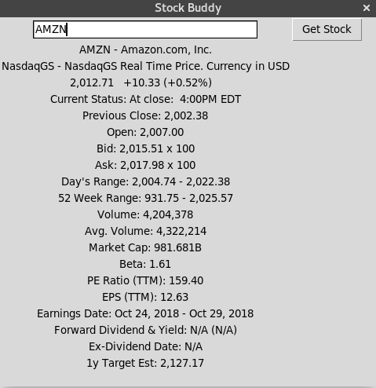
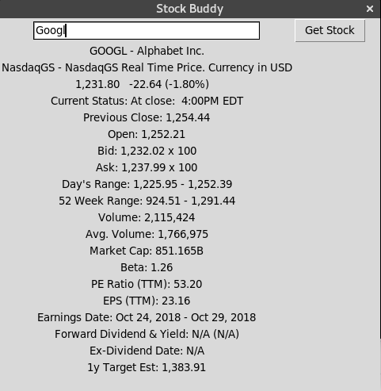
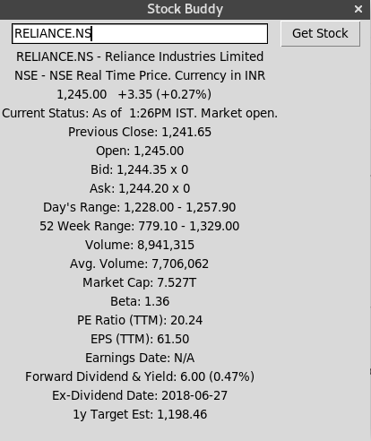

# stock-buddy
GUI Application that provides real time stock price details and much more.<br> Following deatils are provided by the application

*  Stock Symbol (Tickers) details
*  Currency info 
*  Current market price of the stock with today's variance and its percent
*  Current status of market (open/close) along with time info
*  Previous Close
*  Open
*  Bid
*  Ask
*  Day's Range
*  52 week Range
*  Volume
*  Avg. Volume
*  Market Cap
*  Beta
*  PE Ratio(TTM)
*  EPS (TTM)
*  Earning Date
*  Forward Dividend and Yield
*  Ex-Dividend Date
*  1y Target EST 

## Usage 
```Linux
python3 stocks.py
```
Stock-Buddy requires **Stock Symbol (Tickers)** of the Company in the input text field.
<br>For more reference to Stock Symbol (Tickers) click [here](https://www.investopedia.com/terms/s/stocksymbol.asp)

#### Screenshots
 
 



Web scrapping of stock is done from [here](https://finance.yahoo.com/)

